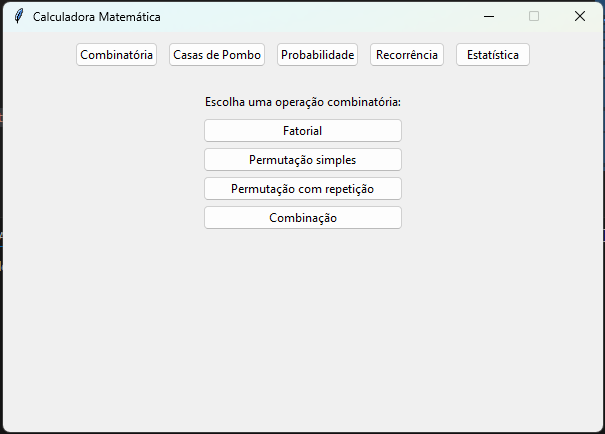
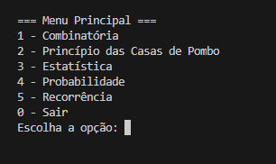

# Sistema de Análise Combinatória e Estatística 
## TDE Matemática Computacional  
**Professor:** MSc. Eduardo Henrique Costa Barbosa  


## Descrição

Projeto desenvolvido para aplicar conceitos de combinatória, probabilidade, recursividade e estatística em um software prático. O sistema realiza:

- Cálculo de permutações, combinações e princípio das casas de pombo  
- Resolução de problemas de probabilidade condicional  
- Aplicação de relações de recorrência (recursividade)  
- Análise estatística com média, variância e desvio padrão  

---

## Funcionalidades

- Interface gráfica simples em Tkinter  
- Interface de linha de comando para uso via terminal  
- Modularização dos cálculos para facilitar manutenção e expansão  

---

## Imagens

Interface Gráfica Tkinter:  


Menu CLI no terminal:  


---

## Como Executar

### Requisitos

- Python 3.x instalado  

### Executar interface gráfica

```bash
python main.py
````

### Executar interface linha de comando

```bash
python main_cli.py
```

---

## Estrutura do Projeto

```
.
├── main.py             # Interface gráfica Tkinter
├── main_cli.py         # Interface CLI
├── combinatoria.py     # Funções de combinatória
├── casas_de_pombo.py   # Princípio das casas de pombo
├── estatistica.py      # Funções estatísticas
├── probabilidade.py    # Funções de probabilidade
├── recorrencia.py      # Recursões matemáticas
└── src/
    ├── img-main.png
    └── img-main-cli.png
```

---

## Autor

Jó Pimentel